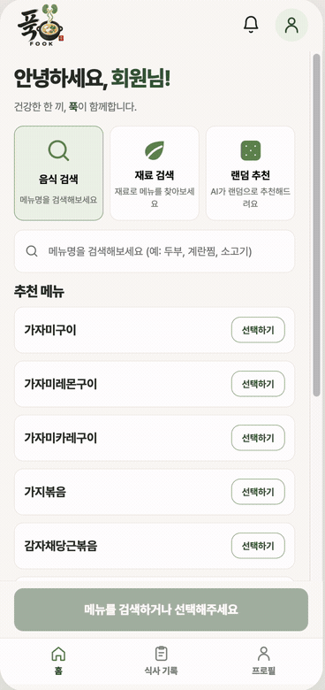
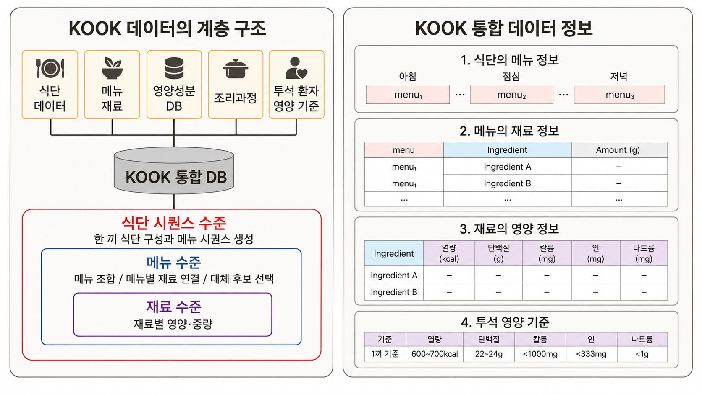
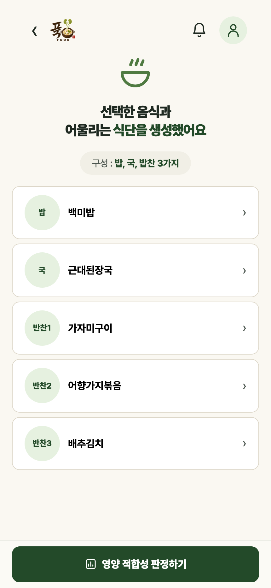
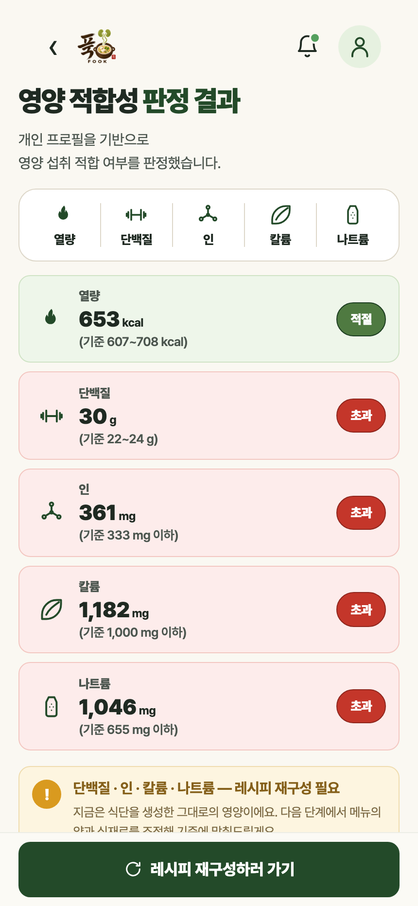
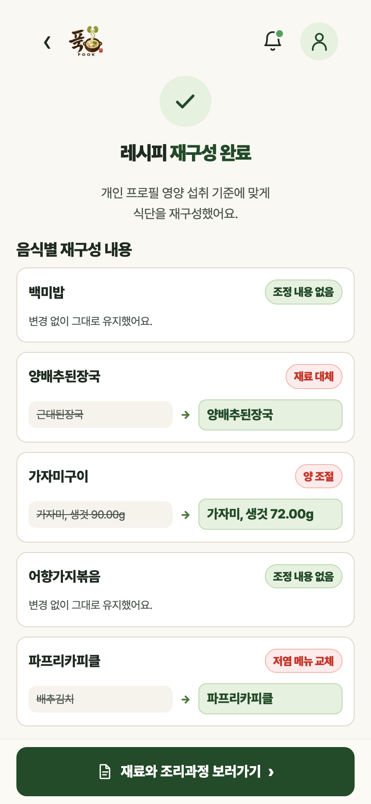
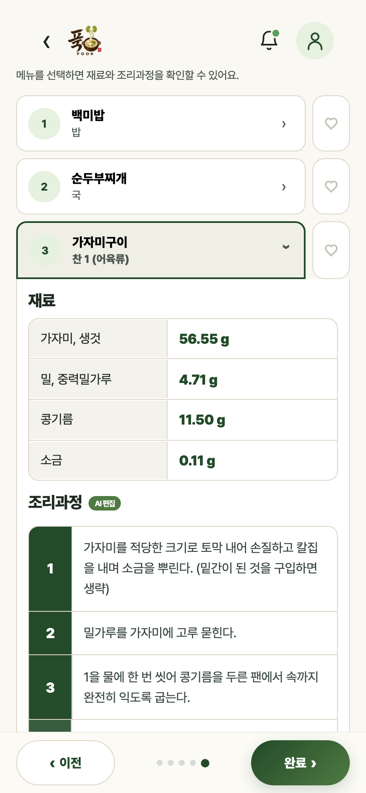
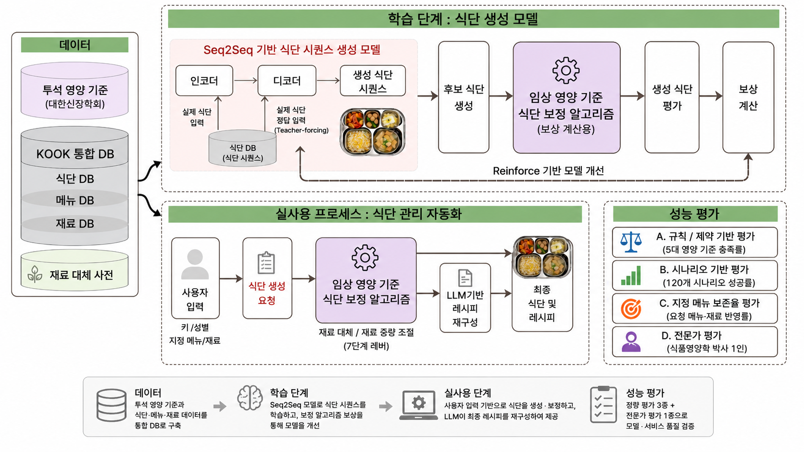

<!--
████████████████████████████████████████████████████████████████████
  wouldu0 · KOOK README
████████████████████████████████████████████████████████████████████
-->

<div align="center">

# 🍚 KOOK

### 혈액투석 환자 맞춤형 AI 식단 관리 솔루션

<br/>


<br/>

> **투석 환자의 개인별 영양 기준을 세우고, AI가 한 끼를 만들고, 기준을 넘으면 스스로 재조정하는 식단 서비스**
> 메뉴 조합만 추천하고 끝나지 않습니다. **재료 단위까지 양을 조절해 기준 안으로 맞춥니다.**

<br/>



<sub>실제 배포 사이트를 조작해 캡처했습니다 — 검색 → 식단 생성 → 영양 판정 → 재구성 → AI 레시피</sub>

<br/>

### 🔗 배포된 서비스

**[https://kook-hemodialysis-meal-ai.vercel.app](https://kook-hemodialysis-meal-ai.vercel.app)**

<sub>무료 호스팅이라 15분간 접속이 없으면 서버가 잠듭니다. 첫 화면이 뜨는 데 최대 1분 걸릴 수 있습니다.</sub>

</div>

---

## 🩺 왜 만들었나요?

혈액투석 환자는 **열량·단백질·칼륨(K)·인(P)·나트륨(Na)** 다섯 가지 영양소를 매 끼
동시에 지켜야 합니다. 여러 영양 기준을 동시에 고려해야 하기 때문에, 한 영양소를
맞추기 위한 조정이 다른 영양소의 기준에 영향을 줄 수 있습니다. 사람이 손으로 다섯
개를 동시에 맞추기는 매우 어렵습니다.

실제로 신장병 관련 환자 커뮤니티에는 이런 어려움이 그대로 드러납니다.

> "식이요법이 힘드네요 ㅠㅠ" · "신장병 환자 식이요법 어떻게 하시나요?" ·
> "저염식하기 어렵습니다, 저염 식단 예시 좀 알려주세요" ·
> "단백질, 칼륨, 인 조절이 너무 어려워요"
> <sub>— 신장병 관련 네이버 카페</sub>

정작 "이 끼니를 무엇으로, 얼마나 먹어야 기준 안에 드는지"까지 식사 전에 계산해주는
서비스는 찾기 어려웠습니다. 기존 서비스는 음식의 영양정보를 제공하거나, 섭취 후
사진·기록을 바탕으로 영양소를 확인하는 방식이 많았습니다. 하지만 사후 기록만으로는
실제 섭취량을 정확히 추정하기 어렵고, 환자는 결국 식사 전에 적절한 메뉴와 양을
스스로 판단해야 합니다. KOOK은 이를 해결하기 위해 **개인 기준을 세우고 → AI가 메뉴와
섭취량을 설계하고 → 기준을 벗어나면 재료 단위까지 스스로 조정하는** 서비스를
만들었습니다.

---

## 🎯 KOOK이 해결하는 문제

| 문제점 | 해결 방법 | 관련 기능 |
|:---|:---|:---|
| 영양 기준을 지키면서도 먹고 싶은 메뉴를 반영한 한 끼를 구성하기 어려움 | Seq2Seq·REINFORCE 기반 식단 생성 — 영양 충족도와 식단 보존도를 함께 고려하도록 보상 설계 | 맞춤 식단 생성 |
| 영양 기준에 맞게 평소 먹던 음식의 재료·조리법을 바꾸기 어려움 | KLUE-BERT·KNN 기반 재료 대체 탐색 + 임상 영양 규칙 적용 | 맞춤 재료·조리과정 제공 |
| 성별·키 등 신체 조건별로 적정 섭취량 판단이 어려움 | 환자 조건별 영양 목표 설정 + 임상 영양 기반 식단 보정 알고리즘 | 맞춤 영양 관리 |

---

## 👩‍💻 담당 역할

3인 팀에서 **데이터 구축부터 AI 아키텍처 설계·모델링, 영양 보정 알고리즘, 백엔드 개발까지 핵심 AI 파이프라인 전반**을 담당했습니다.

| 구분 | 담당 내용 |
|---|---|
| 데이터 | 데이터 수집·정제·전처리 및 통합 영양 DB 구축 |
| AI 시스템 | 전체 AI 아키텍처 설계, 재료 대체·식단 생성 모델 개발 |
| 영양 보정 | 임상 영양 기준 기반 식단 검증·재조정 알고리즘 설계 및 구현 |
| 검증 | 모델 및 알고리즘 성능 평가 |
| 백엔드 | FastAPI 기반 AI API 및 백엔드 개발 |

> 팀 프로젝트 당시 초기 React 프론트엔드 구현은 팀원이 담당했으며, 프로젝트 종료 후
> 서비스 구조 리팩터링·백엔드/RAG 연결·안정성 개선은 개인적으로 추가 진행했습니다
> (아래 "✨ 주요 기능"의 RAG 챗봇, "프로젝트 종료 후 개인 개선" 참고).

---

## 🗂️ 데이터 구축 · 전처리

서로 구조가 다른 **대표식단·국가표준식품성분표·군 조리지침서** 데이터를
하나의 식단 생성·영양 검증 파이프라인에서 사용할 수 있도록 통합했습니다.

단순 병합이 아니라
**식재료명 표준화 → 결측·오류 정리 → 영양성분 매핑 → 메뉴·재료 구조화**를 거쳐,
식단–메뉴–재료 단위를 연결하고 각 재료의 영양성분과 투석 영양 기준을 함께 참조할 수 있는
**KOOK 통합 DB**를 구축했습니다.

| 데이터 | 원본 | 전처리 결과 / 활용 |
|:---|:---:|:---|
| 대표식단 (식생활안전관리원) | 32,182행 | 표준 메뉴 **824종** · 식단 생성 모델 학습 |
| 국가표준식품성분표 (농촌진흥청) | 3,270행 | 표준 재료 **3,391종** · 영양 계산·보정 |
| 군표준조리지침서 (육군본부) | PDF 88p | 추가 메뉴 **260종** · 메뉴 다양성 보완 |

<p align="center">
  
</p>

<p align="center">
  <sub>
    식단 → 메뉴 → 재료의 계층 구조로 데이터를 모델링하고,
    메뉴별 재료·중량과 재료별 5대 영양소, 투석 영양 기준을 연결했습니다.
  </sub>
</p>

---

## ✨ 주요 기능

| 기능 | 설명 |
|:---|:---|
| 🎯 **개인 영양 기준 산출** | 키·성별로 표준체중을 산출해 5대 영양소 목표 범위 결정 |
| 🍳 **메뉴 지정 생성** | 먹고 싶은 음식을 고르면 그것을 중심으로 한 끼 구성 |
| 🥕 **재료 지정 생성** | 냉장고에 있는 재료로 한 끼 구성 |
| 🎲 **랜덤 추천** | 고르기 어려우면 AI가 기준에 맞는 한 끼를 제안 |
| 📊 **영양 적합성 분석** | 5대 영양소를 기준치와 대조해 적합/초과 판정 |
| 🎛️ **자동 재조정** | 기준 초과 시 7단계 레버로 메뉴 교체·섭취량 조정 |
| 🔍 **전/후 비교** | 재조정 전과 후를 나란히 보여주고 변경 이유 설명 |
| 📝 **레시피 재구성** | 바뀐 재료·양에 맞춰 조리법을 LLM이 다시 작성 |
| 🔊 **음성 단계 안내** | 조리 과정을 한 단계씩 읽어줌 (다시 듣기 지원) |
| 📄 **PDF 저장** | A4 **1장**에 맞춘 레시피 문서 생성 |
| 🍽️ **끼니별 기록** | 날짜 + 아침/점심/저녁을 골라 저장, 섹션별로 조회 |
| 📅 **하루 세 끼 생성** | 남은 예산 방식으로 세 끼를 이어서 구성 |
| 👤 **회원 기능** | 가입·로그인·프로필·아이디 찾기·비밀번호 재설정 |
| 🧪 **비회원 체험** | 가상 프로필로 가입 없이 한 끼 체험 |
| 💬 **근거 기반 영양 상담** | 임상 영양 자료 RAG + 영양DB 직접 조회로 식품·투석 식이 질문에 답변 |

---

## 📱 서비스 화면

실제 배포 서비스에서 캡처한 화면입니다.

| 한 끼 식단 생성 | 영양 적합성 판정 |
|:---:|:---:|
|  |  |

| 재조정 전/후 비교 | AI 레시피 재구성 |
|:---:|:---:|
|  |  |

---

## 📊 모델·서비스 검증

120개 시나리오(키·표준체중·요청 방식과 누적 영양 상태를 다르게 구성)로 정량 평가를
진행한 뒤, 별도로 대표 식단 8개에 대한 전문가 검토를 진행했습니다.

- **5가지 영양 기준 충족률 90.8%** — 생성 식단을 투석 영양 기준과 직접 비교
- **식단 추천 성공률 89.2%** — 120개 시나리오 전체 기준, 5가지 영양 기준 충족에 더해 비현실적 재료량·재료 중복 등 품질 조건까지 모두 통과한 최종 판정 (생성 과정의 확률성으로 재실행 시 소폭 변동 가능)
- **요청 메뉴·재료 반영률 94.7%** — 사용자가 지정한 메뉴·재료가 최종 식단에 유지되는 비율
- **비현실적 재료량 발생 1.7%**
- **식품영양학 박사 평가 평균 4.2 / 5** (대표 식단 8개 기준) — 자세한 내용은 바로 아래 참고

### 실측 성능

배포 환경에서 직접 측정한 값입니다.

| 항목 | 측정값 | 비고 |
|:---|:---:|:---|
| 한 끼 생성 시간 | **0.1초** | 모델 로딩 후, 레버 재조정 포함 |
| 메모리 사용량 | **410 MB** | 모델 로딩 400MB + 생성 10MB |
| 모델 로딩 시간 | **10초** | 로컬 기준 (서버 최초 기동 시 1회) |
| 서버 콜드스타트 | **44초** | 무료 플랜 절전 해제 시 |
| API 응답 (깨어난 상태) | **130 ms** | 배포 도메인에서 측정 |
| 지원 메뉴 수 | **992종** | |
| API 엔드포인트 | **24개** | |

---

## 👩‍⚕️ 전문가 평가

서로 다른 체중·메뉴·재료 조건으로 생성한 대표 식단 8개를 식품영양학 박사 1인이
영양 충족률·메뉴 조화(색감/풍미/질감/반복)·제공 적합성 기준으로 평가했습니다.

**평균 4.2 / 5** — 8개 식단 모두 영양 기준을 충족했고, 전반적인 제공 적합성은
높았습니다.

> "모든 식단이 영양 기준을 충족하여 제공 적합성에는 문제가 없었습니다. 전반적으로
> 기계 생성의 이질감은 크지 않았으나, 일부 메뉴 구성에서는 실무 경험이 충분히
> 반영되지 않은 점이 확인되었습니다."
> <sub>— 식품영양학 박사</sub>

다만 일부 식단은 메뉴 조화·식재료 반복·조리 현실성 측면에서 추가 보완이 필요하다는
피드백을 받았습니다.

---

## 🤖 AI 시스템은 어떻게 동작하나요?

KOOK은 학습 단계와 실제 서비스 단계를 분리해 설계했습니다.



<sub>학습 단계에서는 Seq2Seq 기반 식단 생성 모델을 REINFORCE로 개선하고, 실사용
단계에서는 개인 영양 기준에 따라 생성 결과를 검증·보정한 뒤 LLM으로 레시피를
재구성합니다. 오른쪽 성능 평가(A~D)는 위 "모델·서비스 검증" 결과와 같은 기준입니다.</sub>

간단히 흐름만 보면:

```
데이터
  ↓
재료 대체
  ↓
식단 생성
  ↓
영양 기준 검증
  ↓
재료·중량 재조정
  ↓
최종 재검증
  ↓
레시피 재구성
```

각 단계를 기술적으로 풀면:

| 단계 | 기술 |
|:---|:---|
| 재료 대체 | KLUE-BERT 임베딩 + KNN(Annoy)로 저칼륨·저인 대체 재료 후보 탐색 |
| 식단 생성 | Seq2Seq(GRU Encoder–Decoder) + Bahdanau Attention으로 밥·국·반찬 시퀀스 생성 |
| 영양 기준 검증 | 5대 영양소 × 목표 범위 대조 |
| 재료·중량 재조정 | 7단계 레버로 메뉴 교체·섭취량(g) 조정 (바로 아래 "핵심 AI/알고리즘" 참고) |
| 최종 재검증 | 재조정 후 영양성분 다시 계산, 통과할 때까지 반복 |
| 레시피 재구성 | 재조정된 재료·양에 맞춰 LLM이 조리법 재작성 |

생성 단계는 REINFORCE로도 보정됩니다: 영양 기준 통과율과 사용자가 지정한 메뉴·재료가
얼마나 보존됐는지를 함께 보상으로 줘서, 처음부터 기준에 가까운 조합이 나오도록
학습시켰습니다.

<details>
<summary>🔬 보상 함수 상세</summary>

```
보상 = 영양 기준 통과율 × (0.5 + 0.5 × 최종 보존율)

영양 기준 통과율 = 통과한 영양 기준 수 / 5
개별 보존율      = 1 − min(1, 총 그램 변화량 / 조정 전 총 그램)
최종 보존율      = 0.7 × 유저 지정 메뉴 보존율 + 0.3 × 전체 식단 보존율
```

기준을 다 지켜도 사용자가 고른 메뉴·재료가 원형을 잃으면 보상이 깎이도록 설계해,
"기준은 맞지만 전혀 다른 음식"이 되는 걸 막았습니다.

</details>

---

## 🧠 핵심 AI / 알고리즘

이 프로젝트의 핵심입니다. AI가 만든 한 끼가 기준을 넘으면, **7개의 레버를 정해진 순서로 당겨** 기준 안으로 넣습니다.

> 순서가 중요합니다. 칼륨을 먼저 낮추면 단백질이 무너지고, 열량을 먼저 채우면 인이 넘칩니다.
> **영향 범위가 좁은 것부터** 당기도록 순서를 고정했습니다.

| 순서 | 레버 | 하는 일 |
|:---:|:---|:---|
| 1 | `lever_kimchi` | 김치를 저염·저칼륨 종류로 교체 (나트륨·칼륨 동시 감소) |
| 2 | `lever_sodium` | 양념 나트륨 감량 |
| 3 | `lever_sodium_extra` | 1·2로 부족하면 추가 감량 |
| 4 | `lever_potassium` | 고칼륨 메뉴 교체 · 채소 섭취량 조정 |
| 5 | `lever_phosphorus` | 고인 메뉴 교체 · 섭취량 조정 |
| 6 | `lever_protein` | 단백질을 목표 범위 안으로 |
| 7 | `lever_calorie` | 남은 열량을 간식으로 채움 |

<details>
<summary><b>🌱 두부·콩류 전용 경로</b> — 흡수율을 반영한 개선 작업, 3,600회 검증</summary>

**문제 발견**: 두부·콩류가 포함된 식단을 반복 검증하는 과정에서, 한 영양소를 맞춘 뒤
다른 영양소를 보정하면 앞 단계에서 맞춰둔 결과가 다시 깨지는 패턴을 발견했습니다.

> 인(P) 초과 → 인 보정 → 기준 통과 → 단백질 부족 → 두부·콩류 증량 → 인 재초과

즉 일반적인 순차 보정만으로는 일부 두부·콩류 식단에서 phosphorus↔protein 충돌
(핑퐁)이 반복되고 있었습니다.

**원인**: 문제는 영양소 하나의 계산식이 아니라, 보정 단계끼리 서로 영향을 주는
구조에 있었습니다. 인 레버가 흡수보정 인(Peff) 기준으로 인 수치를 기준 안에 맞춰도,
이어지는 단백질·열량 레버가 부족분을 채우려고 재료량을 다시 늘리면서 raw P(실제
섭취 인) 기준으로는 인이 재초과될 수 있었습니다 — 식물성 단백질은 인 함량 대비
흡수율이 낮아 이 충돌이 다른 앵커보다 두부·콩류에서 뚜렷했습니다.

**해결**: 전체 재조정 알고리즘 자체는 바꾸지 않고, 두부·콩류가 핵심 단백질원인
경우에만 조건부 전용 경로로 분기했습니다.

- `_plant_protein_path_needed`로 두부·콩류가 앵커인지 먼저 판별
- 인(P) hard constraint를 raw P(실제 섭취 인) 기준으로 통일
- 단백질·열량을 보정하려고 양을 늘릴 때는 **남은 raw P 예산의 90%까지만** 쓰도록
  상한(cap)을 적용
- 이 조건부 증량 cap은 두부·콩류가 앵커가 아닌 식단에는 전혀 영향을 주지 않음

| 함수 | 역할 |
|:---|:---|
| `_plant_protein_path_needed` | 두부·콩류 앵커인지 판정해 경로 분기 |
| `lever_phosphorus_rawP` | 인 판정 기준을 raw P(실제 섭취 인)로 통일 — 흡수보정 인(Peff)은 대체재 선호도 등 최적화 참고용으로만 사용 |
| `lever_protein_capped` | 단백질 증량 시 남은 인(P) 예산의 90%를 상한으로 적용 |
| `lever_calorie_capped` | 열량 부족을 보충할 때도 raw P 예산을 넘지 않도록 제한 |

**검증 결과 — 3,600회 페어 실행**

| 항목 | 개선 전 | 개선 후 |
|:---|:---:|:---:|
| 두부·콩류 성공률 | 94% | ✅ **100%** |
| 후보 0개(생성 실패) | 6% | ✅ **0%** |
| 비현실적 섭취량 발생 | 46% | ✅ **20%** |
| 어육류 결과 변화 | — | ✅ **2,400건 전부 동일 (회귀 없음)** |

**이후 업데이트**: 당시에는 두부·콩류 경로에만 먼저 raw P 판정을 적용해
phosphorus↔protein 충돌을 해결했습니다. 이후 전체 서비스 감사에서 일반 인 레버
(`lever_phosphorus`)도 같은 Peff/raw P 기준 불일치를 안고 있다는 걸 발견해, 현재는
**모든 경로의 인 hard constraint를 raw P로 통일**했고 Peff는 대체재 선택의 보조
(타이브레이크) 신호로만 씁니다. 두부·콩류 전용 경로의 단백질·열량 증량 시 raw P
예산 cap(위 표)은 그대로 유지됩니다.

> 13단계 진단→해결 전 과정은 [`model-development/generation-model_seq2seq-rl/research-log/phosphorus-protein-resolution/`](model-development/generation-model_seq2seq-rl/research-log/phosphorus-protein-resolution/ADOPTION_REPORT.md)에 남겨뒀습니다.

</details>

<details>
<summary><b>💬 추가 구현: 영양 상담 RAG 챗봇 (+ 멀티턴 후속 질문)</b></summary>

식단 생성 외에도 투석 식이에 관한 자유 질문에 답할 수 있도록 영양 상담 RAG 챗봇을
구현했습니다(`FOOK_rag_chatbot.py`, `POST /chat`, 내 정보 → **영양 상담 챗봇**).

특정 식품 질문은 KOOK 영양DB에서 실제 영양성분과 1회 섭취량을 직접 계산하고, 일반적인
투석 식이 질문은 임상 영양 자료를 검색해 답변합니다. 수치·등급·최종 판정은 코드가 결정하고
LLM은 설명만 담당하도록 분리해, 생성형 모델이 계산 결과를 임의로 바꾸지 못하도록
설계했습니다 — 이 기능에서 가장 중요한 설계 원칙입니다.

> 식품 질문 → 영양DB 직접 조회 · 일반 식이 질문 → RAG · 도메인 외 질문 → Scope gate 차단

질문은 식품 DB 조회 → 도메인 범위 판정 → RAG 검색 순으로 라우팅하며, 근거가 부족한
경우에는 임의로 답을 생성하지 않습니다. 또한 전체 대화 이력을 서버에 저장하지 않고 직전
식품 정보(`context_food`)만 전달해 "그럼 몇 조각?", "칼륨은?" 같은 한 턴 후속 질문을
처리합니다.

현재 프론트엔드에서는 식품별 수치·등급 및 RAG 상담을 제공하며, 하루 누적 섭취량을 반영한
개인화 최종 판정 로직은 백엔드에 구현되어 있지만 아직 UI에는 연결하지 않았습니다.

</details>

---

## 🏗️ 시스템 구성 · 배포

```
┌─────────────────────────────┐
│  사용자 (모바일 · PC 브라우저) │
└──────────────┬──────────────┘
               │ HTTPS
               ▼
┌─────────────────────────────┐
│  Vercel — React 19 + Vite   │   kook-hemodialysis-meal-ai.vercel.app
│  화면 · PDF 생성 · 음성 안내  │
└──────────────┬──────────────┘
               │ REST API (CORS)
               ▼
┌─────────────────────────────┐
│  Render — FastAPI (Docker)  │   kook-backend-ibbe.onrender.com
│  ┌────────────────────────┐ │
│  │ Seq2Seq + Attention    │ │  ← 한 끼 생성
│  │ REINFORCE 체크포인트   │ │  ← 기준 준수 보정
│  │ 7단계 재조정 레버      │ │  ← 영양 기준 맞춤
│  │ KLUE-BERT+KNN 대체모델 │ │  ← 저칼륨·저인 재료 대체
│  │ LLM 레시피 재구성      │ │  ← OpenAI API
│  │ RAG 영양 상담 챗봇     │ │  ← OpenAI Embeddings + GPT
│  └────────────────────────┘ │
└──────┬───────────────┬──────┘
       │               │
       ▼               ▼
┌───────────────┐  ┌──────────────────┐
│ Neon          │  │ 음식·영양 데이터 │
│ Postgres      │  │ CSV · XLSX · JSON │
│ 회원·기록 데이터 │  │ 메뉴 992종        │
└───────────────┘  └──────────────────┘
```

---

## 🛠️ 기술 스택

> 비전공자도 이해할 수 있도록, 각 기술을 **KOOK에서 어떻게 썼는지** 위주로 적었습니다.

| 영역 | 핵심 기술 | 활용 |
|:---|:---|:---|
| **AI / ML** | TensorFlow · Seq2Seq(GRU) · Bahdanau Attention · REINFORCE | 식단 생성 및 영양 기준 기반 생성 보정 |
| **재료 대체** | KLUE-BERT · KNN | 저칼륨·저인 대체 재료 탐색 |
| **LLM / RAG** | OpenAI API · Embeddings | 레시피 재구성 · 근거 기반 영양 상담 |
| **Backend** | FastAPI · Pydantic · SQLAlchemy | AI API · 요청 검증 · DB 연동 |
| **Frontend** | React · TypeScript · Vite | 웹 서비스 UI |
| **Database** | Neon PostgreSQL | 회원·식단 기록 데이터 저장 |
| **Deploy** | Vercel · Render · Docker | 프론트·백엔드 배포 |

---

## 🔄 프로젝트 종료 후 개인 개선

팀 프로젝트 종료 후에도 서비스를 개인적으로 유지하며, **AI 결과 품질 분석 → 데이터
활용 구조 개선 → 배포 후 AI 서비스 안정화** 순서로 실제 배포 환경을 기준으로 추가
개선했습니다.

### 1. 생성 식단의 반복 패턴 진단

동일한 조건으로 반복 생성했을 때 일부 국 메뉴로 결과가 쏠리는 현상을 발견했습니다.
원인을 추적한 결과, 생성 모델이 입력 seed의 국 위치 정보를 그대로 따라가는 패턴을
확인했습니다.

국 위치 정보를 가린 상태로 재학습하는 실험을 진행한 결과 국 고유 종류가
**4.1 → 28.6개**, 영양 기준 충족률이 **68.8% → 97.6%**로 개선됐습니다. 하지만 이
결과는 동일 입력을 반복한 stress-test 조건에서 나온 결과였고 실제 서비스 환경과는
조건이 달랐습니다. 숫자가 개선됐다는 이유만으로 production 모델을 바로 교체하지
않고 **후속 개선 후보로만 보존**했습니다.

> 생성 결과의 이상 패턴을 발견하고 원인을 실험으로 검증했지만, 평가 조건의 한계를
> 고려해 바로 배포하지 않았습니다.

전체 실험 과정은
[`research-log/soup-diversity-masking/`](model-development/generation-model_seq2seq-rl/research-log/soup-diversity-masking/FINDINGS.md)와
[`benchmarks/historical_protocol_reeval_current_baseline/`](model-development/benchmarks/historical_protocol_reeval_current_baseline/) ·
[`benchmarks/soup_diversity_reeval_2026-08-14/`](model-development/benchmarks/soup_diversity_reeval_2026-08-14/)에 남겨뒀습니다.

### 2. 식단 기록 데이터를 실제 활용 가능한 형태로 개선

기존 "기록하기" 기능은 사실상 즐겨찾기(`favorites`) 중심으로 저장되고 있어, 사용자가
언제 어떤 식단을 먹었고 당시 영양 섭취량이 어땠는지 이후 기능에서 활용하기 어려운
구조였습니다.

저장 대상을 실제 식사 기록 테이블(`meal_records`)로 분리하고, 사용자가 고른
**날짜·끼니**와 함께 저장하도록 했습니다. 메뉴 이름만 남기지 않고 `/generate` 결과의
`raw_menus`·`intake`·`dish_ingredients`도 함께 저장하도록 보강해, 식단 이름만 남는
기록이 아니라 **당시 생성된 메뉴·재료·영양 섭취량을 다시 활용할 수 있는 기록
데이터**로 바꿨습니다.

이렇게 마련한 데이터는 향후 하루 누적 섭취량 기반 추천에 활용할 수 있는 기반이 됩니다
— 다만 현재 `consumed`/`used_today`가 자동으로 다음 식단 생성에 연결되어 있지는
않고, 그 연결에 쓸 수 있는 데이터 구조를 마련한 단계입니다.

### 3. 배포 환경의 식단 생성 오류 재현·해결

실제 배포 환경에서 `/generate_day` 요청이 간헐적으로 500 오류를 내는 문제를
발견했습니다. 여러 요청이 동시에 들어올 때 공유 TensorFlow 생성 모델에 동시에
접근하면서 발생하는 문제(race condition)로 원인을 추적했습니다.

모델 호출 구간에 Lock을 적용하고, 서버 시작 시 모델을 미리 한 번 실행하는 warm-up을
추가했습니다. 수정 전 오류를 직접 재현한 뒤 수정 후 **동시 요청 40/40 성공**을
확인했습니다.

> 실제 서비스에서 발생한 AI 생성 오류를 재현하고 원인을 찾아 수정한 뒤 다시
> 검증했습니다.

이외에도 API 접근 제어·오류 정보 노출 방지와 프론트엔드 구조 리팩터링을 통해 서비스
운영 안정성과 유지보수성을 보완했습니다.

---

## 📈 핵심 문제 해결 경험

| 핵심 경험 | 해결한 문제 |
|:---|:---|
| 🎛️ **다목적 영양 최적화** | 열량·단백질·칼륨·인·나트륨 기준이 서로 영향을 주는 문제를 순차 보정과 조건부 제약으로 해결 |
| 🔬 **AI 결과 품질 검증** | 생성 결과의 반복 패턴과 평가 결과를 실제 출력 기준으로 확인하고, 검증되지 않은 개선은 배포하지 않음 |
| 🏥 **임상 기준의 코드화** | 혈액투석 영양 기준을 계산 가능한 규칙과 제한 조건으로 구현 |
| 💬 **안전한 LLM 활용** | 영양 수치·등급·판정은 코드가 담당하고 LLM은 설명과 조리 텍스트 생성에 활용 |
| 🩺 **배포 후 운영 검증** | 실제 서비스에서 발생한 AI 생성 오류를 재현하고 수정 후 회귀 여부까지 검증 |

---

## 📁 프로젝트 구조 · 🚀 실행 방법

<details>
<summary><b>🗂️ 프로젝트 구조 보기</b></summary>

```
KOOK/
│
├── 📂 backend/                                  # AI 엔진 + API 서버
│   ├── server_FOOK.py                           # 🚀 FastAPI 엔드포인트 (24개)
│   ├── app_core_FOOK.py                         # 🧠 한 끼 생성 총괄 · 영양 기준 산출
│   ├── FOOK_adjust_levers.py                    # 🎛️ 영양소 재조정 7단계 레버 ⭐핵심
│   ├── recipe_editor_FOOK.py                    # 📝 LLM 레시피 재구성
│   ├── FOOK_rag_chatbot.py                      # 💬 영양 상담 RAG 챗봇
│   ├── FOOK_build_rag_kb.py                     # 챗봇 지식베이스 구축 스크립트
│   ├── 📂 evaluation/                           # RAG 검색 품질 평가(Top-k 적중률 · no-answer 정확도 · scope gate 라우팅 정확도 · fallback 안전성 평가)
│   ├── database.py                              # Neon Postgres 연결
│   ├── auth_utils.py                            # 비밀번호 해싱 · 세션 토큰
│   ├── Dockerfile                               # Render 배포용 컨테이너
│   ├── requirements.txt
│   │
│   ├── 📂 data/                                 # 음식 · 영양 데이터
│   │   ├── FOOK_menus_kor.csv                   # 메뉴 목록 (992종)
│   │   ├── FOOK_음식명_재료_조리방법.xlsx           # 메뉴별 재료 · 조리법
│   │   ├── FOOK_recipe_steps.json               # 조리 단계
│   │   ├── FOOK_rag_kb.json                     # 챗봇 지식베이스(청크+임베딩)
│   │   ├── 📂 rag-source/                       # 챗봇 지식베이스 원본 출처 문서 4종
│   │   └── 1~12월_raw.xlsx                      # 월별 식단 원본
│   │
│   ├── 📂 sql/
│   │   ├── 001_full_schema.sql                  # 테이블 7개 생성
│   │   └── 002_account_recovery.sql             # 아이디 찾기 · 비밀번호 재설정
│   │
│   ├── 📂 Diet-Generation-As-Sequence-master/   # 생성 모델
│   │   └── .../results_sweep_FOOK/i002/
│   │       └── ckpt-1.data-00000-of-00001       # ⭐ 강화학습 체크포인트
│   │
│   ├── 📂 Exploiting-Food-Embeddings-.../       # 재료 대체 임베딩
│   ├── schemas.py                               # 요청 스키마(Pydantic) — TF 모델 import 안 함
│   ├── rate_limit.py                            # 인메모리 rate limiter(로그인·OpenAI 엔드포인트용)
│   ├── 📂 tests/                                # pytest 236개 — TF 모델 로딩 없음(RAG 챗봇 테스트는 영양DB 엑셀만 로딩)
│   ├── 📂 scripts/smoke_generate_day.py         # 실제 모델 대상 수동 스모크 테스트(CI 미포함)
│   ├── requirements-dev.txt                     # CI용 최소 의존성(pytest, fastapi, httpx 등)
│   └── 식약청_영양성분10.4(수정).xlsx              # 영양성분 DB
│
├── 📂 model-development/                        # 🔬 AI 엔진 개발·검증 이력 + 기반 논문 출처 (배포 미포함)
│   ├── generation-model_seq2seq-rl/             # 생성모델 학습 코드(Model.py, train_FOOK.py 등)
│   │   └── research-log/                        # 인/단백질 충돌 해결(채택) · 국 다양성 개선(미배포) 진단 기록
│   ├── ingredient-substitution_klue-bert-knn/   # 재료 대체 모델 코드(foodbert/ 등)
│   ├── benchmarks/                              # 성능·회귀 검증 스크립트 + 결과 리포트
│   │   └── rl_v2_work/                          # 2차 RL 리워드 튜닝 라운드(R0~R5) 실험 기록
│   └── clinical-review/                         # 임상영양사 검수용 문서 3종
│
├── 📂 frontend/                                 # React 앱
│   ├── 📂 src/
│   │   ├── App.tsx                              # 라우팅 + 전역 상태(AppContext) 제공만 담당
│   │   ├── types.ts                             # 공용 타입 (ApiResult 등 서버 응답 형태 포함)
│   │   ├── 📂 services/api.ts                   # 백엔드 통신 + 로컬↔서버 동기화 (엔드포인트별 함수)
│   │   ├── 📂 hooks/                            # useApp(AppContext), useSpeech(TTS)
│   │   ├── 📂 pages/                            # 🎨 화면 컴포넌트(라우트 1개 = 파일 1개)
│   │   │   ├── 📂 onboarding/, auth/            # 스플래시·온보딩, 로그인·회원가입·비번찾기
│   │   │   ├── 📂 account/                      # 내 정보, 식단 기록/관리/PDF 보관함, 조리 팁
│   │   │   ├── 📂 meal/                         # 홈~하루식단~생성~판정~재구성~비교~완성
│   │   │   └── 📂 recipe/                       # 레시피 상세, PDF 미리보기
│   │   ├── 📂 components/
│   │   │   ├── icons.tsx, Logo.tsx              # 공용 아이콘 · 로고
│   │   │   ├── 📂 layout/                       # Shell, Header, BackHeader, BottomNav 등
│   │   │   └── 📂 meal/                         # Nutrients, RecipeBody/RecipeList 등 화면 간 공용 조각
│   │   ├── 📂 utils/                            # date.ts, menu.ts, nutrition.ts, auth.ts (순수 함수)
│   │   ├── fookData.ts                          # 서버 미연결 시 폴백용 예시 데이터
│   │   ├── mockup.css                           # 화면 디자인
│   │   ├── fluid.css                            # 📱 휴대폰 크기별 유동 대응
│   │   └── styles.css
│   │
│   ├── 📂 public/assets/
│   │   ├── kook-logo.png
│   │   └── onboarding-1~5.png, onboarding-home.png
│   │
│   ├── .env.production                          # 배포 시 백엔드 주소
│   ├── vercel.json                              # SPA 라우팅 설정
│   └── package.json
│
├── 📂 docs/
│   └── DEVLOG.md                                # 개발 변경 이력 (v13 등)
│
├── 📂 .github/workflows/ci.yml                  # 백엔드 pytest 236개 + 프론트 타입체크·빌드 (TF 모델 로딩 없음)
└── render.yaml                                  # Render 배포 설계도
```

</details>

<details>
<summary><b>⚙️ 실행 방법 보기</b></summary>

**1️⃣ 클론**
```bash
git clone https://github.com/wouldu0/kook-hemodialysis-meal-ai.git
cd kook-hemodialysis-meal-ai
```

**2️⃣ 백엔드 — 가상환경 및 패키지**
```bash
conda create -n kook_env python=3.9
conda activate kook_env

cd backend
pip install -r requirements.txt
```

**3️⃣ 환경변수 설정** (⭐ 중요)

`backend/.env` 파일을 만들고 아래 두 줄을 채웁니다.

```env
DATABASE_URL=postgresql://...        # Neon Postgres 연결 주소
OPENAI_API_KEY=sk-...                # 레시피 재구성 · 음성 안내 · 영양 상담 챗봇용
```

> ⚠️ `.env`는 `.gitignore`에 등록되어 있습니다. **저장소에 올리지 마세요.**
> `OPENAI_API_KEY`가 없어도 서버는 뜹니다. 레시피 재구성·음성 안내·영양 상담 챗봇만 동작하지 않습니다.

**4️⃣ DB 테이블 생성** (최초 1회)
```bash
psql "$DATABASE_URL" -f sql/001_full_schema.sql
psql "$DATABASE_URL" -f sql/002_account_recovery.sql
```

**5️⃣ 백엔드 실행**
```bash
python -m uvicorn server_FOOK:app --port 8000
```
> 최초 기동 시 모델을 읽느라 10초쯤 걸립니다. `Application startup complete`가 뜨면 준비 완료입니다.
> API 문서는 http://127.0.0.1:8000/docs 에서 볼 수 있습니다.

**6️⃣ 프론트엔드 실행** (새 터미널)
```bash
cd frontend
npm install
npm run dev
```
> http://localhost:5173 으로 접속합니다. 개발 모드는 자동으로 로컬 백엔드(`127.0.0.1:8000`)를 사용합니다.

**🚀 배포**

| 대상 | 서비스 | 방법 |
|:---|:---|:---|
| 프론트엔드 | Vercel | `main` 브랜치 push → 자동 빌드 (1~2분) |
| 백엔드 | Render | `render.yaml` 기반 Blueprint → push 시 자동 재빌드 (10~15분) |
| 백엔드 주소 변경 | — | `frontend/.env.production`의 `VITE_API_URL` 수정 |

</details>

---

## ⚠️ 한계 및 향후 개선

- **의료진 처방을 대체하지 않습니다.** 생성된 식단은 참고용이며, 실제 식이요법은
  반드시 담당 의료진·임상영양사와 상의해야 합니다.
- **실제 혈액 검사 수치는 반영하지 않습니다.** 키·성별로 산출한 표준체중 기반 기준으로
  목표를 세우며, 개인의 실제 혈중 칼륨·인·나트륨 수치는 입력받지 않습니다.
- **전문가 평가에서 확인된 한계**: 8개 대표 식단 모두 영양 기준은 충족했지만, 메뉴
  조화·식재료 반복·조리 현실성 측면은 개선 여지가 있다는 의견을 받았습니다.
- **아이디/비밀번호 찾기는 데모 환경 기준의 간소화된 인증입니다.** 이메일·SMS 발송
  수단이 없어 이름+생년월일 확인만으로 처리합니다(비밀번호 자체는 PBKDF2-SHA256
  310,000회 + 랜덤 salt로 해싱, 세션 토큰도 해시로 저장). 무차별 대입 시도는 IP별
  rate limit(`/auth/login` 5분 10회, `/auth/reset-password` 15분 5회)으로 늦추지만,
  본인 확인 자체가 약하다는 한계는 남아있습니다. 실제 서비스로 운영한다면 이메일/SMS
  OTP 같은 별도 인증 수단이 필요합니다.

---

<div align="center">

<br/>

*"기준을 세우고, 만들고, 넘으면 스스로 고칩니다."* 🍚🎛️

</div>
